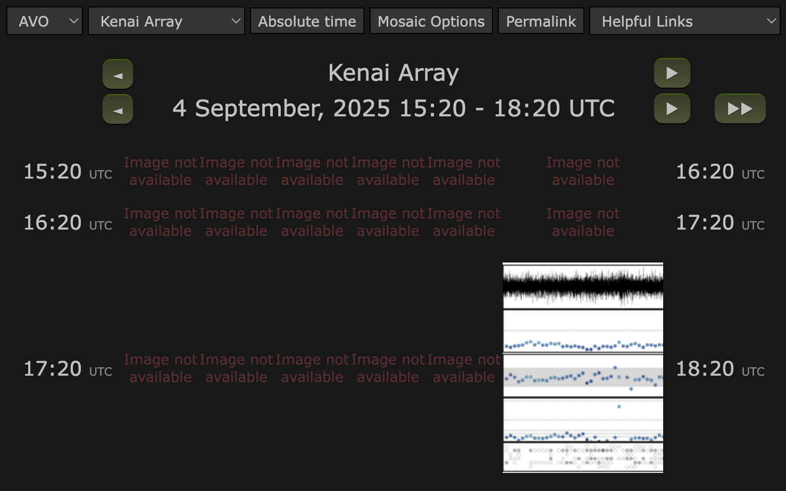
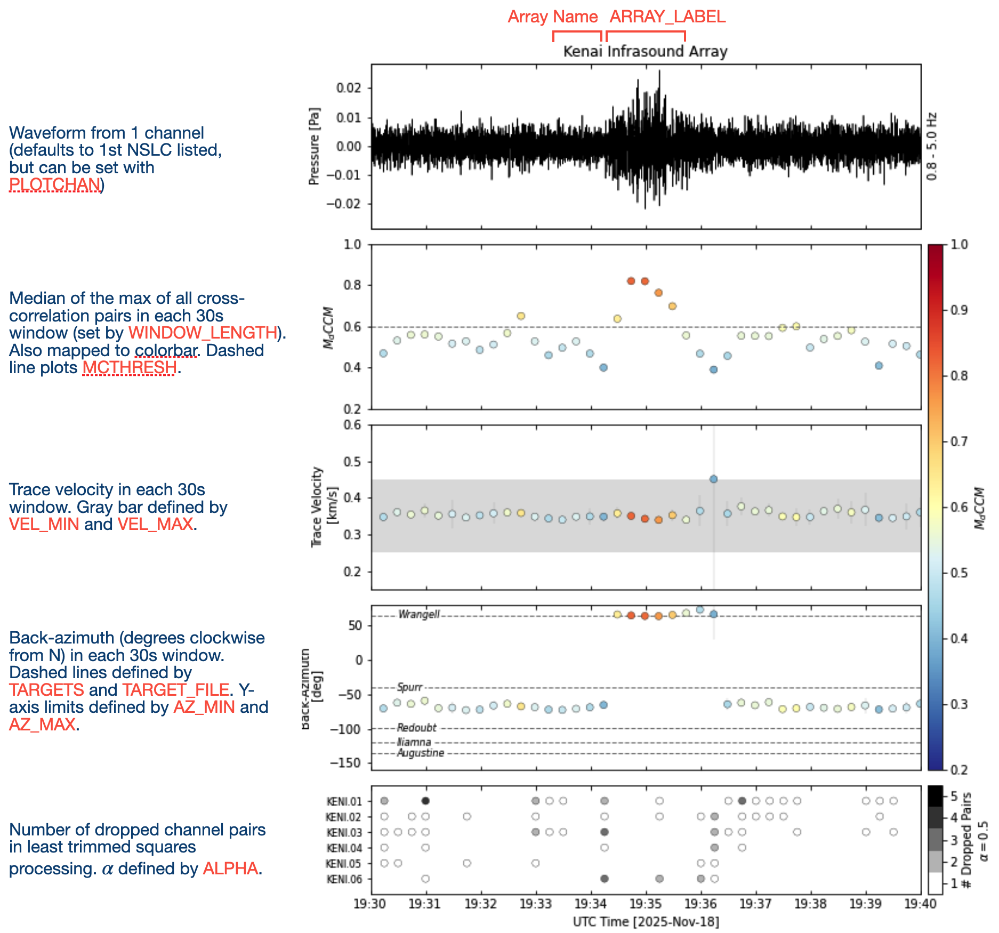
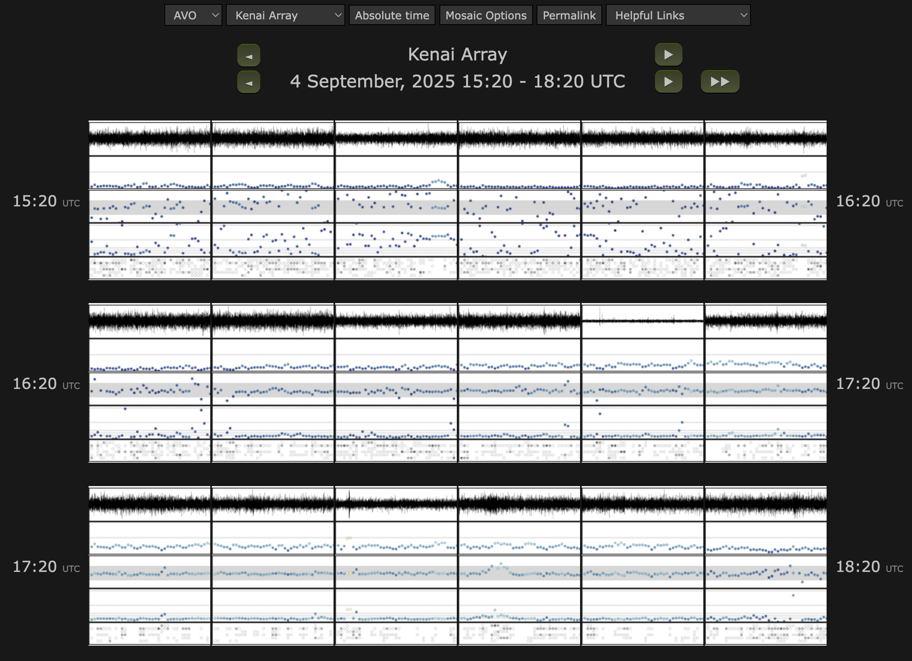

## Quick-start
There are 3 command-line tools to run ipensive
1. ipensive-run
    - main command to process data
2. ipensive-backfill
    - used to backfill data
3. ipensive-metadata
    - creates/updates the station xml metadata file
##
To run ipensive, `cd` to the main ipensive directory and type the following:
```
ipensive-run
```

This should create an `output/` folder with  `output/html/` and `output/ascii_output/` subdirectories:
```bash
ipensive
├── config/
├── data/
├── src/
...
├── output/
│   ├── html/
│   └── ascii_output/
└── ...
```

Navigate to and open `output/html/index.html` with your web browser to verify the webpage and images were generated. Or open using:
```
open output/html/index.html
```
It should look like this:
<br/><br/>

You should be able to toggle between the different arrays either through the dropdown menus or the top row of arrows. Clicking on the thumbnail images generated should open a large-scale version with more detail, as described below:
<br/>

Next, let's backfill the past 3 hours (using the `-dt` flag) of just the Kenai and Sand Point arrays (using `-a` flag) by running:
```bash
ipensive-backfill -dt 3h -a Kenai,Sand_Point
```

This process should take &plusmn; 3.5 minutes, depending on data availability and download speeds from EarthScope. The resulting webpage should look something like this:
<br/><br/>

>NOTE:
>The images themselves will look different based on more recent data

## Configuration Files
There are 2 configuration files in `config/`:
```bash
ipensive
├── config/
    ├── ipensive_config.yml
    └── arrays_config.yml
├── data/
├── src/
└── ...
```

1.  [`ipensive_config.yml`](../config/ipensive_config.yml) controls the data source and the output locations
2.  [`arrays_config.yml`](../config/arrays_config.yml) defines the arrays, processing parameters, and plot controls

Both files have example/template entries in them to demonstrate the structure and available configuration options. And their corresponding target and metadata files are located in `data/`. The simplest step would be to edit these `config/*yml` files in place with your arrays, data source, and desired output locations. The path to a separate `ipensive_config.yml` can also be provided as an argument to the `ipensive-run`, `ipensive-backfill`, and `ipensive-metadata` scripts. And the path to `arrays_config.yml` can also be defined within `ipensive_config.yml`.

>NOTE:
>There is also the option to create environment variables `IPENSIVE_CONFIG` and `ARRAYS_CONFIG` defining paths to separate locations of these configs. This is the recommended method for automatic processing via cron.


### System config: `ipensive_config.yml`
This config file defines
1. Data Source:
    - `CLIENT_TYPE` (e.g., *earthworm, fdsn, sds, local_fdsn*)
    - `HOSTNAME`
    - `PORT` (if relevant)
    - `TIMEOUT` (optional. Defaults to 30s)

2. Output Directories:
    - `OUT_WEB_DIR`: <directory_path> location to output html and images
    - `OUT_ASCII_DIR`: <directory_path> location to output ascii files of processing results
    - `LOGS_DIR`: <directory_path> location to output log files 
        >NOTE: must set environment variable `FROMCRON=yep` to write log output

3. Metadata and back-azimuth target information:
    - `STATION_XML`: <path_to_file> (station.xml file updated routinely by `ipensive-metadata`)
    - `TARGETS_FILE`: <path_to_file> (.csv file with columns: `Target`,`Longitude`,`Latitude`)


### Array config: `arrays_config.yml`
This config file defines:

1. **processing parameters** `PARAMS`
    - processing parameters: controlling data processing details (filters, window length, etc.)
    - plotting parameters: slight control on how a few things appear (mostly this allows for differentiating between acoustic and hydroacoustic velocities)
    >NOTE: these are defaults for all arrays, but each individual array can have its own unique parameters to selectively override the default<br>
    `&defaults` after an entry defines reusable key-value pairs for the ensuing configuration block which can then be merged with later configuration blocks by calling `<<: *defaults` and subsequently modified. See line 1 and line 41 in [`arrays_config.yml`](../config/arrays_config.yml).
    3. **network parameters** `NETWORKS`
    - network and array structure for the web output
4. **array parameters** `<ARRAY_NAME>`
    - `NSLC`: list of array channels. Metadata must be in `STATION_XML` file, or can include lat/lon/gain information manually here
    - `TARGETS`: list of targets for which you want to plot back-azimuths. Must be in `TARGETS_FILE`, or can include lat/lon information manually here
    - Any parameter set in `PARAMS` above can be customized for individual arrays here
##
>Note. `example_2/config` and `example_2/data` provide an example of how you can configure ipensive to run with multiple `arrays_config` files

## Usage
Assuming you are in the right environment
1. **Manually**

    ```ipensive-run -c <config_file> -t <yyyymmddHHMM>```

     `-c` and `-t` are optional. If `-c` is not supplied, the config defaults to either the path defined by environment varable `IPENSIVE_CONFIG` (1st) or `config/ipensive_config.yml` (2nd). If `-t` is not supplied, the time is rounded to the most recent 10-minute mark. 
     
     See ```ipensive-run -h``` for more options. In particular, the ```-a``` option is useful for processing a subset of arrays if more than one are defined in `arrays_config.yml`

2. **Automatically on a cron**

    ```*/10 * * * * ipensive-run >> /dev/null 2>&1```
    >NOTE: must set environment variable `FROMCRON=yep` to redirect log output to a file

3. **Back populate**

    ```bash
    ipensive-backfill -s 202507010000 -e 202507020000
    ```

    See ```ipensive-backfill -h``` for more options.

4. **Update Metadata**
    ```bash
    ipensive-metadata -c <config_file>
    ```
    This will update the `data/stations.xml` file with station-channel lat/lon information used for array processing. Ideally this would get run somewhat periodically, though not as often as the array processing itself.


### Webpage configuration
The webpage is automatically generated each time using jinja2 to populate the [index.template](../templates/index.template) file with the network and array structure from the config file.
(This method was adapted from a forked version of this code by Israel Brewster, and the html and javascript front-end was originally developed by Tom Parker.)